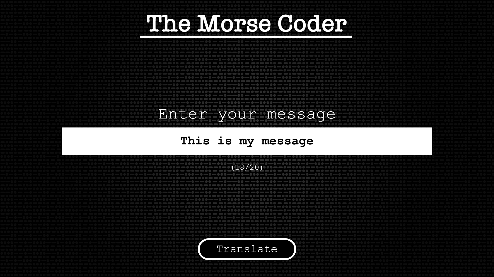
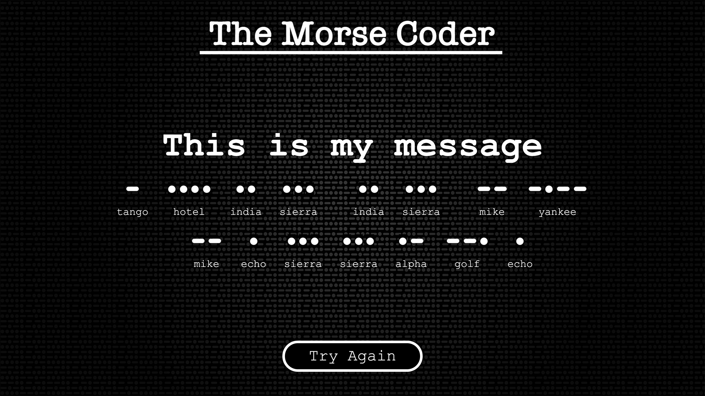

# **Mid-Weight Frontend Developer Brief**

This application demonstrates a typical journey flow for an activation at an event. Visitors to an event are drawn to an activation using an attractor (or home screen). The visitor is prompted to continue where they will then perform some interaction or input. After completing the interaction, the visitor is then presented with results based on their input and offered an option to repeat the process.

## **Project Overview**

An application will be created that can translate words into Morse Code.

For example, if the visitor enters "SOS" they will shown 3 dots, 3 dashes and 3 dots.

The application will consist of 3 screens...

1. Attractor
1. Interaction
1. Results

### **1. Attractor**

Normally, an attractor will consist of movement to draw the visitor to the activation e.g. a looping video or animation. However, for this application a static image will be used.

The following functionality should be applied to the interaction screen...

* Use `attractor.png` for the attractor image. 
* Clicking anywhere on the screen should take the visitor to the Interaction screen.

### **2. Interaction**

The primary interaction for this application is an input text box allowing the visitor to the enter a simple message.

The following functionality should be applied to the interaction screen...

* Use `background.png` for the background image. 
* Input Box should have focus on entry to this screen.
* Maximum length of message is 20 characters
* Input should only accept alphanumerics and spaces.
* Show a dynamic count (below input box) of characters used.
* The "Translate" button should be disabled until characters have been entered.
* Colour (text and border) for the disabled button should be `#808080`.
* If no interaction (clicks and keypresses) occur on this screen for 30 seconds, then the application should automatically go back to the attractor.

### **3. Results**

The results screen should present the message in morse code to the visitor. As well as showing the dots and dashes, it should also show the equivalent phonetic e.g. alpha, bravo, charlie, etc. The application should use the suppled `translations.json` for performing any character lookups.

The following functionality should be applied to the results screen...

* Use `background.png` for the background image. 
* Use `dot.png` for the dot images and use `dash.png` for the dash images.
* The "Try Again" button should take the visitor to the previous screen (Interaction).
* If no interaction (clicks) occur on this screen for 30 seconds, then the application should automatically go back to the attractor.

## **Style Guidelines**

* Unless stated, the default colour is White for all elements e.g. text, buttons.
* Font used is `Courier New`.

## **Development Guidelines**

* Use one of the following frameworks :- Angular 7+, Vue.js or React
* Target browser is Google Chrome (latest)
* Make good use of ES6 currently supported by Chrome 
* Fixed size of 1920 x 1080 e.g. non-responsive
* All required files e.g. images, references used by the application can be found in the `assets` folder.

## **Additional Information**

Although no transitions or animations have been defined, feel free to add any to enhance the visitors experience. This is not a requirement of this brief and only add if you feel the need to.

Example outputs can be found in thr `examples` folder.

## **Project Completion and Submission**

Once complete, please upload to either GitHub or Bitbucket (making sure the project is publicly accessible).

Please include any build instructions with your project using a readme (in markdown format).

